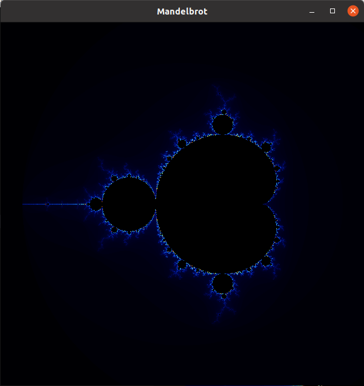

# Updates

The previous application built using the SDL library has been ported to OpenCV which provides a much more informative feedback. Particularly speaking, earlier the zooming action was accomplised by tracking the mouse movements through a callback to form an imaginary zooming region. But now using the OpenCV library the zooming action has been made more intutive and easy to use.
# Udacity CPP Nanodegree: Capstone Mandelbrot Project

This Capstone Project is meant to show the students(here mine) ability to integrate what has been learned throughout C++ Nanodegree program. This project demonstrates that I can independently create applications using a wide range of C++ features.

## Mandelbrot set
The Mandelbrot set is the set of complex numbers c for which the function `f(z) = z^2 + c` does not **diverge** when iterated from `z = 0`, i.e., for which the sequence `f(0)`, `f(f(0))`, etc., remains bounded in absolute value.

This application enables investigating the Mandelbrot set flexibily and is capable of scaling to high precision investigation when proportional comutation power is availablle. This Repo consists of two versions of the same application-
1. The first version maps each pixel to a point on the complex plane sequentially i.e. serial program execution. On branch **serial_computation**.
2. The second version first divides the entire window into sub windows based on the supported hardware concurrenct and then maps each pixel in each sub window to the complex plane parallely to increase the speed. The increase in speed due to parallel execution is clearly evident during usage. On branch **parallel_computation**.

## Application preview



## Zooming in action


## Dependencies for Running Locally
* cmake >= 3.7
  * All OSes: [click here for installation instructions](https://cmake.org/install/)
* make >= 4.1 (Linux, Mac), 3.81 (Windows)
  * Linux: make is installed by default on most Linux distros
  * Mac: [install Xcode command line tools to get make](https://developer.apple.com/xcode/features/)
  * Windows: [Click here for installation instructions](http://gnuwin32.sourceforge.net/packages/make.htm)
* gcc/g++ >= 5.4
  * Linux: gcc / g++ is installed by default on most Linux distros
  * Mac: same deal as make - [install Xcode command line tools](https://developer.apple.com/xcode/features/)
  * Windows: recommend using [MinGW](http://www.mingw.org/)
* OpenCV 4.1

## Basic Build Instructions

1. Clone this repo.
2. Make a build directory in the top level directory: `mkdir build && cd build`
3. Compile: `cmake .. && make`
4. Run it: `./Mandelbrot`

## Usage instructions

1. The application window is capable of handling zoom requests with a visual feedback using OpenCV's selctROI feature
2. To zoom, draw a rectangle by moving the left mouse key pressed from top left corner to bottom right corner. Press SPACE or ENTER when happy with the selection
3. The drawn rectangle is turned into a square internally to maintain aspect ratio
4. Depending on the window size initially set and the max iterations set, the window will be updated in less than a second or in a couple of seconds to show the slected complex plane region of the Mandelbrot set
5. To quit press 'q' at the prompt when asked or when decided to proceed with zoom.

## Command line usage to generate nth order Mandelbrot set
```shell
# z = z^(n) + c
# ./Application window_size maximum_iterations order_of_mandelbrot_set
$> ./Mandelbrot 600 600 6
```
You would be interested to know that the number of lobes in the Mandelbrot set are always 1 less than the order of the set.

Here is the output that can be seen in the window for a 6th order Mandelbrot set


## Debugging

It is possible that you might run into this error 

`undefined reference to symbol 'pthread_create@@GLIBC_2.2.5'`,

When this happens, remove the `-std=c++17` flag from **CMakeLists.txt** file and run `make` again. This should solve the strange error.

## Run Parameters

1. kScreenDim - Display window dimension (the bigger this value is the more computations and hence possible to see some delay)
2. maxIter - Maximum number of iterations to check if the points on complex plane cross the 2.0 threshold
3. MandelbrotSetOrder - Determines the Mandelbrot set order to compute ` z = std::pow(z, SET_ORDER) + c`
## Credits

Some of the core computing functions are adopted from this article https://solarianprogrammer.com/2013/02/28/mandelbrot-set-cpp-11/